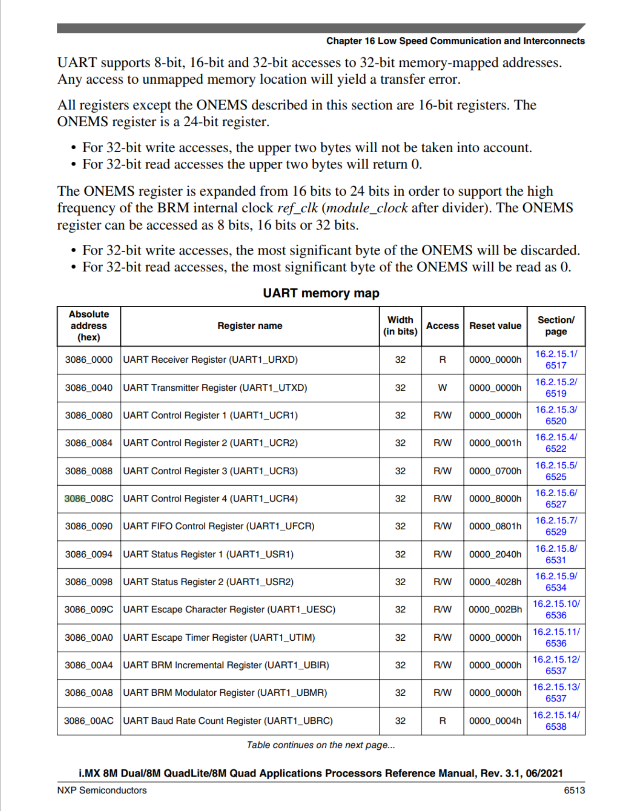

i.MX8M 시리즈에서 UART 장치를 활성화하기 위해 메모리 맵(Memory Map) 주소를 기반으로 디바이스 트리(Device Tree)를 작성하는 과정은 하드웨어와 소프트웨어를 연결하는 아주 좋은 예시입니다.

구체적인 주소와 함께 하드웨어 트리 구조가 어떻게 코드로 변환되는지 단계별로 설명해 드릴게요.

---

### 1. i.MX8MQ UART1 메모리 맵 (하드웨어 사양)

NXP에서 제공하는 i.MX8MQ Reference Manual에 따르면, 첫 번째 시리얼 포트인 **UART1**의 하드웨어 주소 정보는 다음과 같습니다.

| 장치 (Device) | 시작 주소 (Base Address) | 크기 (Size) | 인터럽트 (IRQ) |
| --- | --- | --- | --- |
| UART1 | 0x30860000 | 64 KB | 26 |

이 주소는 CPU가 UART 컨트롤러의 내부 레지스터에 접근하기 위한 **물리적 대문**입니다.

---


---

### 2. 단계별 디바이스 트리 작성 예제

#### Step 1: SoC 공통 레벨 정의 (imx8mq.dtsi 등)

먼저 SoC 수준에서 하드웨어의 절대적인 주소와 속성을 정의합니다. 앞서 확인한 메모리 맵 주소가 여기에 들어갑니다.

```
/ {
	soc {
		aips1: bus@30000000 {  // AIPS1 버스 아래에 UART가 매달려 있음
			uart1: serial@30860000 {
				compatible = "fsl,imx8mq-uart", "fsl,imx21-uart";
				reg = <0x30860000 0x10000>; // 메모리 맵 주소와 크기(64KB)
				interrupts = <GIC_SPI 26 IRQ_TYPE_LEVEL_HIGH>;
				clocks = <&clk IMX8MQ_CLK_UART1_ROOT>,
					 <&clk IMX8MQ_CLK_UART1_ROOT>;
				clock-names = "ipg", "per";
				status = "disabled"; // 기본적으로는 꺼둠
			};
		};
	};
};

```

제시해주신 내용은 리눅스 커널이나 U-Boot에서 하드웨어 구성을 정의할 때 사용하는 **디바이스 트리(Device Tree)** 소스의 일부입니다. i.MX8M Quad 프로세서의 **UART1(직렬 통신)** 컨트롤러가 시스템 버스에 어떻게 연결되어 있는지를 설명하고 있습니다.

---

## 1. 계층 구조 및 버스 연결

디바이스 트리는 하드웨어의 물리적 연결 구조를 트리 형태로 나타냅니다.

- soc { ... }: 프로세서 내부의 System on Chip 영역임을 나타냅니다.
- aips1: bus@30000000: i.MX8M의 내부 버스 중 하나인 AIPS-1(AHB to IP Interface Bridge)입니다.@30000000: 이 버스 제어기의 시작 주소입니다.UART, I2C, SPI 같은 주변 장치(IP)들이 이 브리지를 통해 CPU와 데이터를 주고받습니다.

---

## 2. UART1 노드 상세 분석 (uart1: serial@30860000)

이 부분이 실제 UART1 하드웨어 설정의 핵심입니다.

### 📍 주소 및 크기 (reg)

- reg = <0x30860000 0x10000>;0x30860000: UART1 제어 레지스터가 시작되는 베이스 주소입니다.0x10000: 이전 질문에서 계산했던 64KB입니다. 즉, 이 UART 컨트롤러가 0x30860000부터 0x3086FFFF까지의 주소 공간을 점유한다는 뜻입니다.

### ⚙️ 드라이버 매칭 (compatible)

- compatible = "fsl,imx8mq-uart", "fsl,imx21-uart";운영체제가 이 장치를 구동하기 위해 어떤 드라이버를 사용할지 결정합니다.먼저 i.MX8MQ 전용 드라이버를 찾고, 없으면 호환성이 검증된 i.MX21 드라이버를 사용하라는 의미입니다. (i.MX 시리즈는 하드웨어 IP 설계의 연속성이 높기 때문입니다.)

### ⚡ 인터럽트 (interrupts)

- interrupts = <GIC_SPI 26 IRQ_TYPE_LEVEL_HIGH>;GIC_SPI 26: ARM의 인터럽트 컨트롤러(GIC)에서 관리하는 **26번 공유 주변 장치 인터럽트(SPI)**를 사용합니다.IRQ_TYPE_LEVEL_HIGH: 신호가 'High' 레벨일 때 인터럽트가 발생하도록 설정되어 있습니다.

### 🕒 클록 설정 (clocks)

- clocks = <&clk IMX8MQ_CLK_UART1_ROOT>, ...;UART가 동작하기 위해 필요한 클록 소스를 지정합니다.ipg: 버스 인터페이스용 클록, per: 실제 데이터 통신 속도(Baud rate)를 결정하는 주변 장치 클록입니다.

---

## 3. 상태 설정 (status)

- status = "disabled";이 장치가 기본적으로는 비활성화되어 있다는 뜻입니다.실제 보드(예: EVK 보드) 설정 파일(.dts 또는 .dtsi)에서 이 UART를 사용하려면 이 값을 "okay"로 덮어써야(override) 합니다.

---

### 💡 요약 및 활용

이 코드는 **"주소 0x30860000에 있고 크기가 64KB인 UART1 장치가 AIPS1 버스에 달려 있는데, 현재는 꺼져 있다"**는 정보를 커널에 전달합니다.

U-Boot 소스코드를 분석하실 때, `include/configs/imx8mq_evk.h`나 관련 보드 파일에서 이 주소(`0x30860000`)가 디버그 콘솔용으로 정의되어 있는지 확인하면 됩니다.


#### Step 2: U-Boot 및 부팅 환경 설정 (imx8mq-u-boot.dtsi)

제공해주신 파일들처럼, 부팅 초기 단계(SPL)에서도 이 UART를 사용하려면 `u-boot,dm-spl` 속성을 추가해야 합니다.

```
&soc {
	u-boot,dm-spl; // [cite: 4]
};

&aips1 {
	u-boot,dm-spl; // [cite: 4]
};

&uart1 {
	u-boot,dm-spl; // [cite: 1]
};

```

- 중요: UART1에 접근하기 위해 상위 부모 노드인 soc와 aips1 통로도 함께 열어줘야 합니다.

#### Step 3: 보드 레벨 활성화 (imx8mq-evk.dts)

최종적으로 특정 보드에서 UART1을 실제 디버그 콘솔로 사용하겠다고 선언합니다.

```
/ {
	chosen {
		stdout-path = &uart1; // 시스템 로그를 UART1로 출력
	};
};

&uart1 {
	pinctrl-names = "default";
	pinctrl-0 = <&pinctrl_uart1>; // 핀 설정을 연결
	status = "okay"; // 비로소 장치를 활성화
};

```

---

### 3. 메모리 맵과 디바이스 트리의 연동 원리 요약

1. reg = <0x30860000 0x10000>;: 드라이버가 커널에서 실행될 때, 이 주소 범위를 가상 메모리로 매핑하여 하드웨어 레지스터를 직접 제어합니다.
2. interrupts = <26>;: UART에 데이터가 들어오면 CPU에 26번 신호를 보내 알려주며, OS는 이 번호를 보고 UART 드라이버를 호출합니다.
3. 트리 구조의 통로: &aips1 노드를 거치지 않고서는 0x30860000 주소에 접근할 수 없기 때문에, 계층 구조 전체에 u-boot,dm-spl과 같은 활성화 속성이 반복적으로 등장하게 됩니다.

이 예제를 통해 **하드웨어 문서상의 주소**가 어떻게 **소프트웨어의 설정 데이터**로 변환되어 부팅 시점에 인식되는지 확인할 수 있습니다. NotebookLM에 이 예제 코드를 넣고 **"이 UART 설정이 실제 드라이버 호출까지 이어지는 과정을 설명해줘"**라고 질문하시면 더 깊은 분석이 가능할 거예요.
