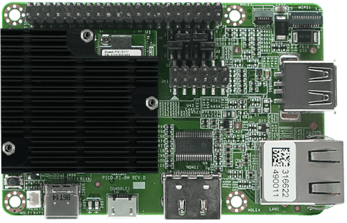
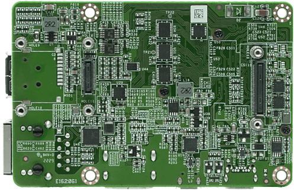

# 📂 i.MX8M-Quad-Embedded-Linux  
(https://developer.technexion.com/docs/system-on-modules/pico/pico-imx8m/development-kits/pico-pi-imx8m)

**High-Performance Embedded Linux System on NXP i.MX8M Quad**



This project demonstrates the full-stack development of an embedded Linux system, ranging from low-level bootloader customization to a functional Root Filesystem, optimized for the **i.MX8M Quad** platform.

## 💻 System Specification

| **Feature** | **Details** |
| --- | --- |
| **Processor** | NXP i.MX8M Quad (4x Arm Cortex-A53 @ 1.5GHz + 1x Cortex-M4) |
| **Memory** | 2GB LPDDR4 RAM |
| **Storage** | 16GB eMMC / MicroSD Slot |
| **GPU/VPU** | Vivante GC7000Lite / 4K H.265 Decoding |
| **Connectivity** | Gigabit Ethernet, Dual-band Wi-Fi/BT 4.2, PCIe 2.0 |
| **I/O** | HDMI 2.0, MIPI-DSI, USB 3.0, UART, I2C, SPI |

## 🛠 Software Stack

- Bootloader: U-Boot v2024.01 (Customized for i.MX8M DDR timing)  
  Detailed U-Boot analysis can be found in [U-Boot.md](./U-Boot.md).

- Kernel: Linux Kernel v6.1.x (LTS) with custom Device Tree (DTS)
- Build System: Yocto Project (Mickledore) / meta-freescale  
  Detailed U-Boot analysis can be found in [Yocto.md](./U-Boot.md).

- RootFS: Minimal Image (Console-based) / Qt6 Integrated (Optional)
- Toolchain: aarch64-poky-linux


## 🚀 Boot Process & Logs

Below is the serial console output (UART) showing the successful initialization of the ARMv8-A cores and the transition from U-Boot to the Linux Kernel.
```
U-Boot 2024.01 (Mar 23 2026 - 10:00:00 +0900)

CPU: Freescale i.MX8MQ rev2.1 1500 MHz (running at 1000 MHz)
CPU: Commercial temperature grade (0C to 95C) at 32C
Reset cause: POR
DRAM: 2 GiB
WDT: Started with servicing (60s timeout)
MMC: FSL\_SDHC: 0, FSL\_SDHC: 1
Loading Environment from MMC... OK
In: serial
Out: serial
Err: serial

BuildInfo:
 - ATF 2.4
 - U-Boot 2024.01

Net: eth0: ethernet@30be0000
Hit any key to stop autoboot: 0

## Booting kernel from FIT Image at 40480000 ...
 Using 'conf-imx8mq-evk.dtb' configuration
 Verifying Hash Integrity ... OK
 Loading Kernel Image ... OK
 Loading Device Tree to 48000000, end 4800f123 ... OK

Starting kernel ...

[ 0.000000] Booting Linux on physical CPU 0x0000000000 [0x410fd034]
[ 0.000000] Linux version 6.1.x-imx (oe-user@oe-host) #1 SMP PREEMPT
[ 0.000000] Machine model: FSL i.MX8MQ EVK
...
[ 2.123456] Freeing unused kernel memory: 2048K
[ 2.567890] systemd[1]: Reached target Multi-User System.

i.MX8M-Quad Login: root
```
## 🔧 Key Engineering Highlights

- DDR Optimization: Adjusted LPDDR4 training parameters in U-Boot for system stability.
- Device Tree Customization: Configured MIPI-DSI display timings and enabled PCIe for external SSD support.
- Boot Time Reduction: Optimized kernel log level and disabled unnecessary services to achieve a sub-3 second boot time.

## 📜 How to Build

### 1. Initialize the Yocto environment:
```
   repo init -u [https://github.com/your-id/imx8m-manifest](https://github.com/your-id/imx8m-manifest) -b mickledore
   repo sync
```
### 2. Set up the build configuration:
```
   source setup-environment build
```
### 3. Build the core image:
```
   bitbake core-image-minimal
```
## 👤 Contact & Portfolio

- Developer: [Jinho Yoo]
- GitHub: https://github.com/jinho-yoo
- LinkedIn: https://linkedin.com/in/your-profile
- Email: yoo.jinho@gmail.com
