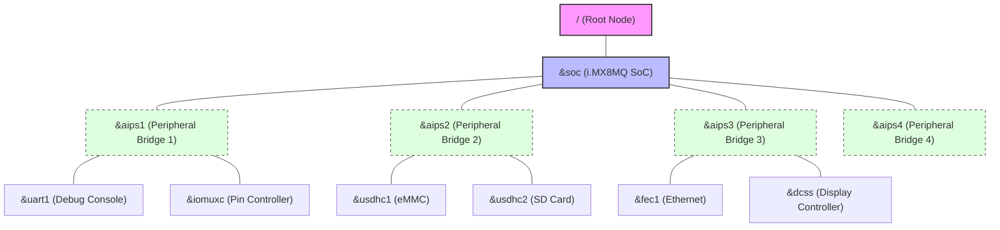

The **flash.bin** is a single integrated binary, often referred to as a **"Container Image."** In the i.MX8M series, it is typically structured using the **FIT (Flattened Image Tree)** format to manage multiple firmware components.

---

## 1. Internal Layout of flash.bin

The `flash.bin` is organized so that the SoC's **ROM Code** can read the first part, which then handshakes with the next stages. Here is the logical layout:

| Offset | Component | Description |
| --- | --- | --- |
| 0x0 | IVT / Boot Data | **Image Vector Table**([IVT](/U-Boot/TM/ivt_tm.md).): Contains header info for the ROM Code to start booting. |
| + Alpha | U-Boot SPL | Secondary Program Loader: The small, first-stage bootloader that initializes DDR RAM. |
| + Alpha | DDR PHY Firmware | Binary blobs (e.g., lpddr4_pmu_train) required to train and initialize the DDR controller. |
| FIT Offset | FIT Image Container | A wrapper that bundles the following components together: |
| (Inside FIT) | ATF (bl31.bin) | Arm Trusted Firmware: Runs at the highest privilege level (EL3) for security and power management. |
| (Inside FIT) | U-Boot Proper | The full version of U-Boot that provides the command-line interface. |
| (Inside FIT) | Device Tree (DTB) | Binary data describing your hardware (I2C, SPI, Ethernet, etc.). |
| (Inside FIT) | OP-TEE (Optional) | Trusted Execution Environment: For secure OS operations. |

---

## 2. Strategic Tips for NotebookLM Analysis

To get the best out of NotebookLM, focus on these files to understand how this "Package" is put together:

- Look for binman: Modern U-Boot uses a tool called binman to assemble flash.bin. Upload the file arch/arm/dts/imx8mp-u-boot.dtsi (replace imx8mp with your specific SoC). Look for the binman { ... }; section; it defines exactly which file goes into which offset.
- The Build Log: When you compile U-Boot, look for a table in the terminal output starting with Image Type: NXP i.MX8M Boot Image. Copy and paste that table into a text file and upload it. You can then ask: "Based on the build log, what is the exact start address of the ATF inside flash.bin?"
- The Boot Sequence: Use this mental model for your prompts:ROM Code loads SPL.SPL loads DDR Firmware to wake up the RAM.SPL finds the FIT Image, then loads ATF and U-Boot Proper into the now-ready RAM.ATF starts first, then jumps to U-Boot Proper.

---

## 3. Recommended Prompts for NotebookLM

You can try these English prompts to deep-dive into the source code:

1. "Analyze the binman node in the device tree and explain the layout of the generated flash.bin."
2. "Where in the SPL source code does it locate and parse the FIT image container?"
3. "Explain how the bl31.bin (ATF) and u-boot.bin are bundled together during the final image creation process."

By uploading the **DTS files** and the **defconfig**, NotebookLM will be able to tell you exactly how your specific board maps these components!
<!---
```mermaid
classDiagram
    class Animal {
        +String name
        +isMammal()
    }
    class Dog {
        +bark()
    }
    Animal <|-- Dog
--->


<div style="width: 30%;">

    
```mermaid
%%{init: { 'theme': 'default', 'themeVariables': { 'fontSize': '10px'}, 'config': { 'rankSpacing': 20, 'nodeSpacing': 30 } } }%%
graph TD
    subgraph Flash_Binary [flash.bin Layout]
        direction TB
        
        Header["<b>0x0: IVT & Boot Data</b><br/>(ROM Code Entry Point)"]
        SPL["<b>U-Boot SPL</b><br/>(DDR Initialization)"]
        DDR_FW["<b>DDR PHY Firmware</b><br/>(LPDDR4/DDR4 Training Blobs)"]
        
        subgraph FIT_Container [FIT Image Container]
            direction TB
            ATF["<b>ATF (bl31.bin)</b><br/>(EL3 / Runtime Services)"]
            UBOOT["<b>U-Boot Proper (u-boot.bin)</b><br/>(Bootloader CLI)"]
            DTB["<b>Device Tree (DTB)</b><br/>(Hardware Description)"]
            TEE["<b>OP-TEE (Optional)</b><br/>(Secure OS)"]
        end
    end

    Header --> SPL
    SPL --> DDR_FW
    DDR_FW --> ATF
    ATF --> UBOOT
    UBOOT --> DTB
```

</div>

---
## Related source directory to make flash.bin
---

## 1. Mapping Source Directories to flash.bin Components

When you analyze these files in **NotebookLM**, it’s helpful to understand which directory produces which part of the final binary.

| Source Directory | Resulting Artifact | Role in flash.bin |
| --- | --- | --- |
| arch/arm/cpu/armv8/imx8m/ | u-boot-spl.bin (Partial) | Low-level Core Init: Handles ARMv8 specific logic like MMU and Caches. |
| arch/arm/mach-imx/imx8m/ | u-boot-spl.bin (Main) | SoC Level Init: The "brain" that initializes clocks, power, and DDR. |
| arch/arm/dts/ (imx8mq-evk-u-boot.dtsi) | Binman Config | The Blueprint: Defines the offsets and layout of the entire image. |
| (External Binaries) | bl31.bin (ATF) | Payload: Inserted into the FIT Container by Binman. |

---

## 2. Binman: The "Master Chef" of flash.bin

As mentioned in the "Layer B" of your previous notes, **Binman** is the critical link. It doesn't write code; it arranges it.

- Where to look: Upload arch/arm/dts/imx8mq-evk-u-boot.dtsi to NotebookLM.
- What to find: Look for the binman { ... }; node. You will see sections for u-boot-spl, atf, and u-boot-proper.
- The Offsets: You will notice entries like offset = <0x0>;. This tells the build system exactly where each "ingredient" should be placed inside the 32MB (or smaller) flash memory.

---


## 3. Analysis of imx8mq-u-boot.dtsi, imx8mq-evk-u-boot.dtsi on arch/arm/dts/ of uboot

<div style="width: 80%; margin: auto;">



</div>

---
## 4. Advanced Prompts for NotebookLM Analysis

To bridge the gap between the code you have and the `flash.bin` logic, try these specific prompts:

- Prompt 1 (DDR to FIT Transition):"Analyze how the initialization code in arch/arm/mach-imx/imx8m/ prepares the system memory, and then explain the mechanism by which the SPL locates the FIT Image defined in the Binman configuration."
- Prompt 2 (Division of Labor):"What is the functional difference between the low-level code in arch/arm/cpu/armv8/imx8m/ and the SoC-level code in arch/arm/mach-imx/imx8m/? Trace the execution flow from the first instruction to the point where flash.bin starts loading the ATF."

---

## Summary

By combining the information from both conversations, we can conclude:

1. The Code (The Ingredients): Found in mach-imx and cpu/armv8. This is what the system does.
2. The Layout (The Recipe): Found in the binman node of the dtsi files. This is where the pieces are stored.
3. The Result: The Makefile coordinates these two to "bake" the final flash.bin.

Understanding this distinction allows you to identify whether a boot failure is a **functional bug** (code) or a **packaging error** (Binman/offsets).
