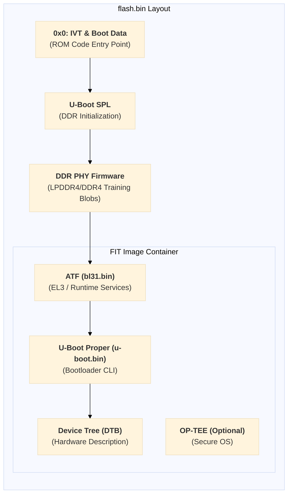

The **flash.bin** is a single integrated binary, often referred to as a **"Container Image."** In the i.MX8M series, it is typically structured using the **FIT (Flattened Image Tree)** format to manage multiple firmware components.

---

## 1. Internal Layout of flash.bin

The `flash.bin` is organized so that the SoC's **ROM Code** can read the first part, which then handshakes with the next stages. Here is the logical layout:

| Offset | Component | Description |
| --- | --- | --- |
| 0x0 | IVT / Boot Data | Image Vector Table: Contains header info for the ROM Code to start booting. |
| + Alpha | U-Boot SPL | Secondary Program Loader: The small, first-stage bootloader that initializes DDR RAM. |
| + Alpha | DDR PHY Firmware | Binary blobs (e.g., lpddr4_pmu_train) required to train and initialize the DDR controller. |
| FIT Offset | FIT Image Container | A wrapper that bundles the following components together: |
| (Inside FIT) | ATF (bl31.bin) | Arm Trusted Firmware: Runs at the highest privilege level (EL3) for security and power management. |
| (Inside FIT) | U-Boot Proper | The full version of U-Boot that provides the command-line interface. |
| (Inside FIT) | Device Tree (DTB) | Binary data describing your hardware (I2C, SPI, Ethernet, etc.). |
| (Inside FIT) | OP-TEE (Optional) | Trusted Execution Environment: For secure OS operations. |

---

## 2. Strategic Tips for NotebookLM Analysis

To get the best out of NotebookLM, focus on these files to understand how this "Package" is put together:

- Look for binman: Modern U-Boot uses a tool called binman to assemble flash.bin. Upload the file arch/arm/dts/imx8mp-u-boot.dtsi (replace imx8mp with your specific SoC). Look for the binman { ... }; section; it defines exactly which file goes into which offset.
- The Build Log: When you compile U-Boot, look for a table in the terminal output starting with Image Type: NXP i.MX8M Boot Image. Copy and paste that table into a text file and upload it. You can then ask: "Based on the build log, what is the exact start address of the ATF inside flash.bin?"
- The Boot Sequence: Use this mental model for your prompts:ROM Code loads SPL.SPL loads DDR Firmware to wake up the RAM.SPL finds the FIT Image, then loads ATF and U-Boot Proper into the now-ready RAM.ATF starts first, then jumps to U-Boot Proper.

---

## 3. Recommended Prompts for NotebookLM

You can try these English prompts to deep-dive into the source code:

1. "Analyze the binman node in the device tree and explain the layout of the generated flash.bin."
2. "Where in the SPL source code does it locate and parse the FIT image container?"
3. "Explain how the bl31.bin (ATF) and u-boot.bin are bundled together during the final image creation process."

By uploading the **DTS files** and the **defconfig**, NotebookLM will be able to tell you exactly how your specific board maps these components!
<!---
```mermaid
classDiagram
    class Animal {
        +String name
        +isMammal()
    }
    class Dog {
        +bark()
    }
    Animal <|-- Dog
--->


```mermaid
graph TD
    subgraph Flash_Binary [flash.bin Layout]
        direction TB
        
        Header["<b>0x0: IVT & Boot Data</b><br/>(ROM Code Entry Point)"]
        SPL["<b>U-Boot SPL</b><br/>(DDR Initialization)"]
        DDR_FW["<b>DDR PHY Firmware</b><br/>(LPDDR4/DDR4 Training Blobs)"]
        
        subgraph FIT_Container [FIT Image Container]
            direction TB
            ATF["<b>ATF (bl31.bin)</b><br/>(EL3 / Runtime Services)"]
            UBOOT["<b>U-Boot Proper (u-boot.bin)</b><br/>(Bootloader CLI)"]
            DTB["<b>Device Tree (DTB)</b><br/>(Hardware Description)"]
            TEE["<b>OP-TEE (Optional)</b><br/>(Secure OS)"]
        end
    end

    Header --> SPL
    SPL --> DDR_FW
    DDR_FW --> ATF
    ATF --> UBOOT
    UBOOT --> DTB
```



